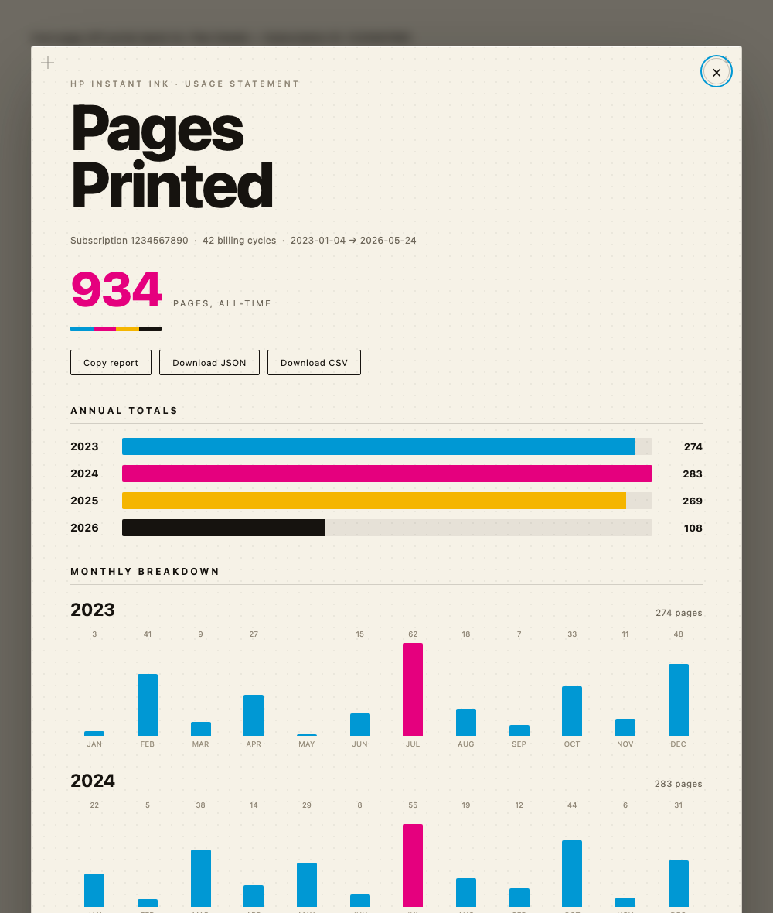

# Instant Ink Usage 🖨️📊

A free bookmarklet to check your **HP Instant Ink usage history** — see how many
pages you've printed each month and each year.

Ever wonder how many pages you've *actually* printed on your HP Instant Ink
plan? This little tool shows your **whole printing history** — every month and
every year — as a clean, friendly chart.

It's a **bookmarklet**: a bookmark you click that adds a one-time button to your
browser. There's nothing to install, no account to create, and nothing runs on
the internet — it works right inside your own browser, using the HP login you
already have.



---

## ✅ How to use it

**👉 The easiest way:** open the **[install page](https://arcataroger.github.io/instant-ink-usage/)**
and follow the three steps. Or do it here:

### 1. Add the button to your browser (one time)

Open the **[install page](https://arcataroger.github.io/instant-ink-usage/)** and
**drag the pink “📊 Instant Ink Usage” button up onto your bookmarks bar.**

> Don't see a bookmarks bar? In most browsers press <kbd>Ctrl</kbd>/<kbd>⌘</kbd>+<kbd>Shift</kbd>+<kbd>B</kbd> to show it.
> Prefer to do it by hand? Make a new bookmark and paste the contents of
> [`build/bookmarklet.txt`](build/bookmarklet.txt) as the address.

### 2. Go to your HP Instant Ink page and sign in

Visit **[portal.hpsmart.com → Print and Payment History](https://portal.hpsmart.com/us/en/print_plans/account_history)**
and log in to your HP account like you normally would. This is HP's own website.

### 3. Click the bookmark

Once you're signed in and looking at that page, click the **Instant Ink Usage**
bookmark you just added. Your report pops up right on the page, showing:

- **Pages printed each year** (with a bar chart)
- **Pages printed each month**, year by year
- Buttons to **copy** the report or **download** it as a spreadsheet (CSV) or a
  data file (JSON)

To close it, press <kbd>Esc</kbd> or click the ✕.

---

## 🔍 How it works (behind the scenes)

Totally fair to want to know what it's doing before you click it. Here's the
plain-English version:

- **It runs only in your browser.** Clicking the bookmark just runs a small
  script on the HP page you already have open. Nothing is installed, and no
  outside website or server is involved.
- **It uses the login you already have.** You sign in to HP yourself, in the
  normal way. The tool **never sees, asks for, or stores your password** — it
  simply piggybacks on the session your browser already created.
- **It asks HP for your history, one month at a time.** Your HP account keeps a
  record of each monthly billing cycle. The tool politely requests each month's
  totals — the exact same numbers HP's own dashboard shows you — and collects
  them all, going back as far as your account goes.
- **It does the math locally.** Because billing months don't line up neatly with
  calendar months, it sorts each day's pages into the real calendar month and
  year, then adds everything up to build the yearly and monthly charts.
- **Nothing leaves your computer.** Your usage data isn't uploaded anywhere. The
  only thing the tool talks to is HP's own website — the same one you're already
  looking at. If you download the CSV/JSON, those files save straight to your
  computer.

And because it's open source, you can read every line yourself in
[`bookmarklet.src.js`](bookmarklet.src.js) before trusting it.

---

## 🛠️ For developers: build it yourself

The bookmarklet is generated from [`bookmarklet.src.js`](bookmarklet.src.js)
(plain JavaScript, no dependencies, needs [Node](https://nodejs.org) 18+):

```bash
npm run build
```

That writes [`build/bookmarklet.txt`](build/bookmarklet.txt) (the bookmark code)
and `docs/index.html` (the install page, also served via GitHub Pages).
[`preview.html`](preview.html) renders the report against fake data so you can
tweak the design without a real account.

## 📄 License

[CC0 1.0 Universal](LICENSE) — public domain. Do anything you like with it, no
permission or credit needed.
